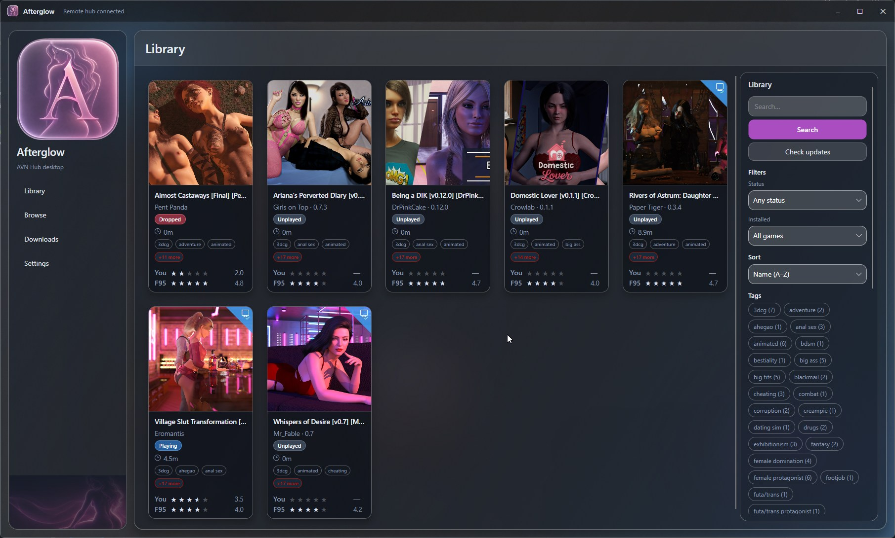
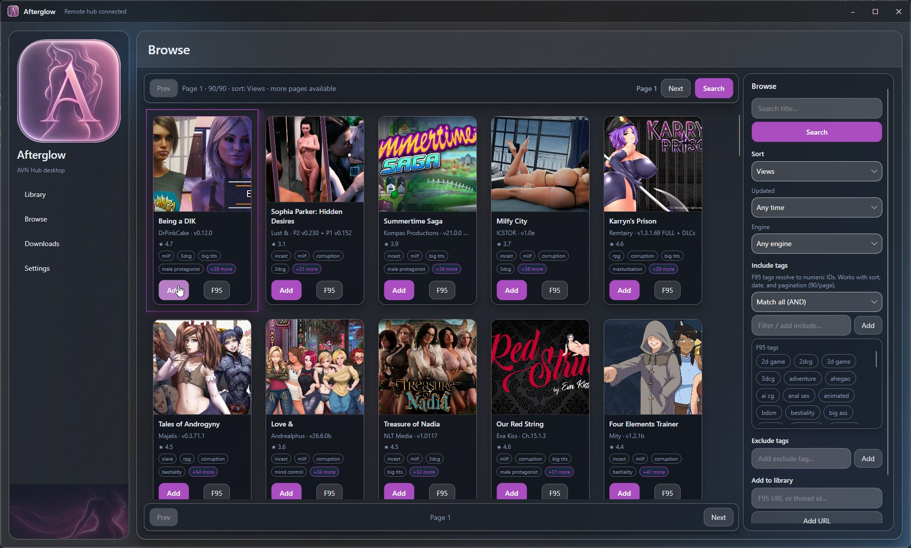
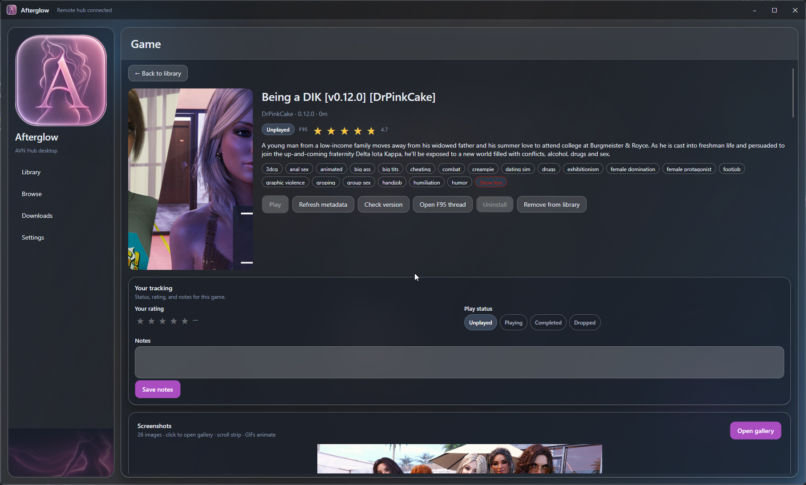
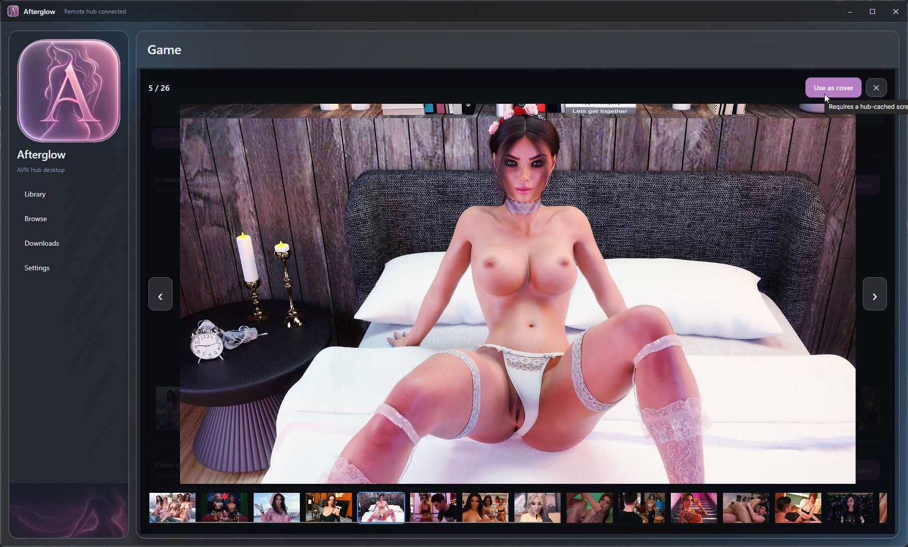
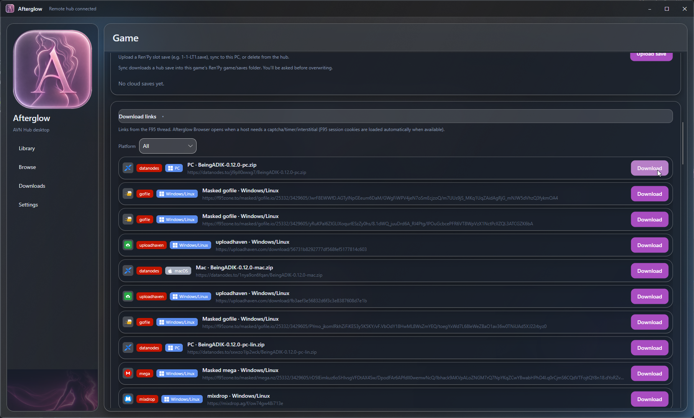
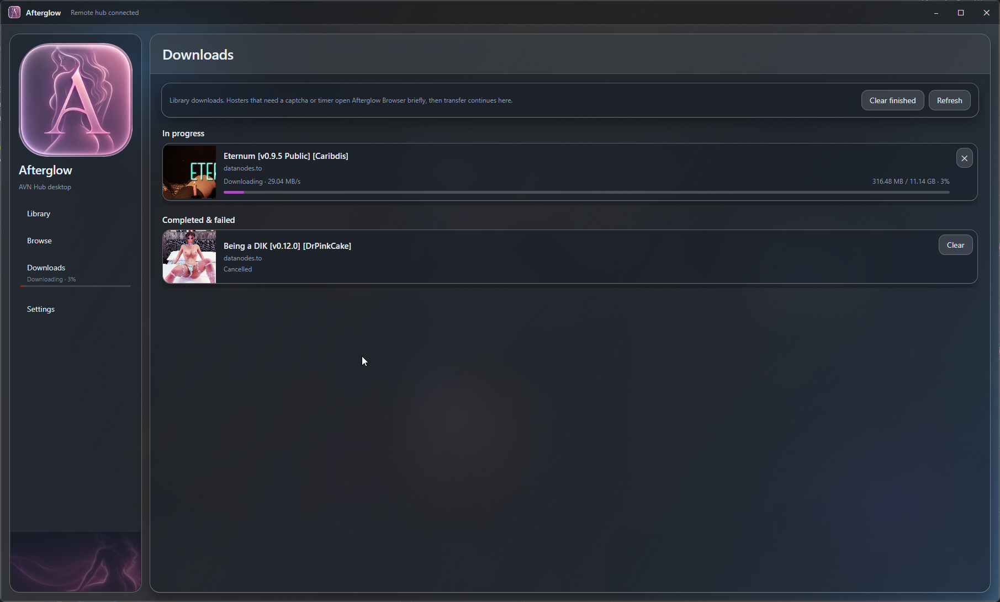
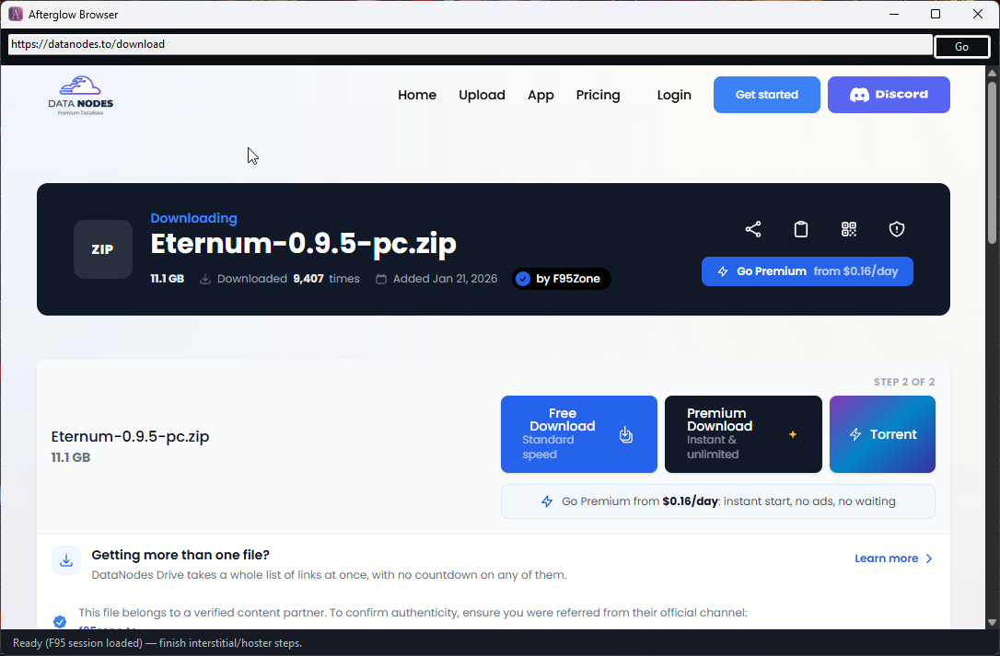
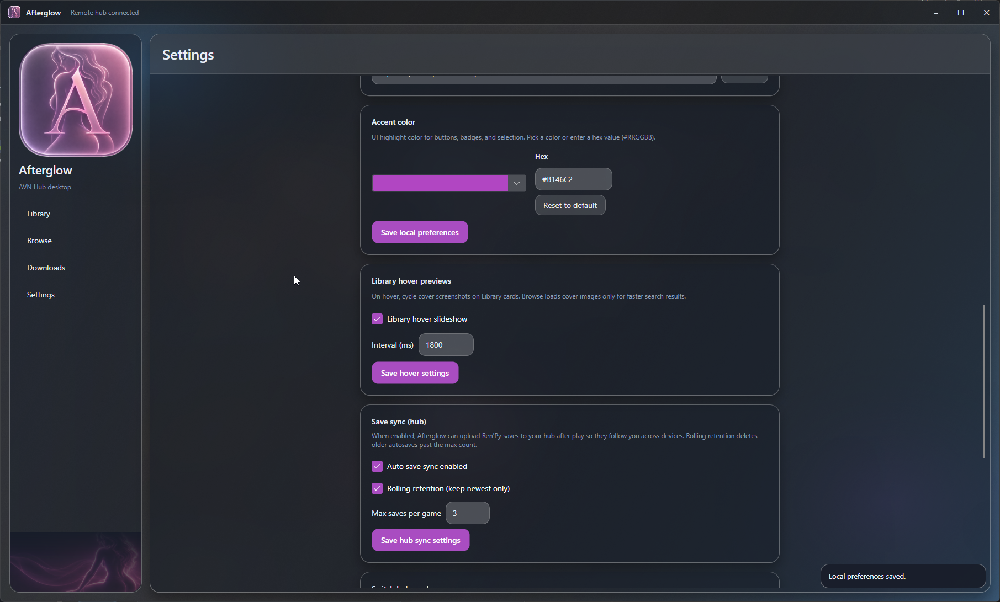

# Afterglow

Windows desktop client for [AVN Hub](https://github.com/goonedoutgames/avn-hub).

Browse F95Zone, manage a library, **download and install** games, launch them, track playtime, and sync Ren'Py saves. AVN Hub holds shared library metadata (and optional save backups when you use a hosted hub).

| | |
|---|---|
| **Platform** | Windows 10/11 (x64) |
| **UI** | Avalonia desktop app |
| **Downloads** | Queue + **Afterglow Browser** (WebView2) for captchas and timers |
| **Hub** | **Remote** (hosted AVN Hub) or **Local** (embedded hub on this PC) |

---

## Screenshots

















---

## Goals

- A **Steam-style library** for F95 AVNs on your PC
- One hub for library metadata — hosted **or** local
- Survive **messy hoster pages** without leaving the app
- Keep **install folders and UI prefs** on this machine; sync **playtime / saves / patches** through the hub

---

## Features

- **Library** — grid/list, status, tags, sort, card size, optional hover slideshow
- **Browse** — F95 search with include/exclude tags, sort, date, and engine filters
- **Game details** — status, half-star ratings, notes, screenshots, custom cover, download links
- **Downloads** — queue, progress, extract into your library folder
- **Afterglow Browser** — WebView2 helper for captchas, timers, and file capture
- **Launch & playtime** — start installs; playtime syncs to the hub
- **Save sync** — Ren'Py saves can upload after play (when enabled on the hub)
- **Settings** — F95 login/cookies, accent, library folder, hub mode, media purge

**Download hosts (MVP):** GoFile, Pixeldrain, direct HTTP(S). Mega is limited. Other hosts can still work when a direct URL is available.

---

## Get started

### Requirements

- Windows 10/11 (x64)
- [.NET 8 Desktop Runtime](https://dotnet.microsoft.com/download/dotnet/8.0) (installer may prompt)
- [WebView2](https://developer.microsoft.com/microsoft-edge/webview2/) (usually already installed with Edge)
- **Remote:** a reachable [AVN Hub](https://github.com/goonedoutgames/avn-hub) API  
- **Local:** release builds typically bundle `avn-hub.exe` as a sidecar

### Install

1. Open [Releases](https://github.com/goonedoutgames/afterglow/releases).
2. Download **`Afterglow-Setup-x64.exe`** (installer) or **`Afterglow-windows-x64.zip`** (portable).
3. Run Afterglow.

### First launch

1. Choose **Remote** or **Local** (change anytime in Settings).
2. Pick a **library folder** for installs/extracts (stays on this PC).
3. **Settings** → log into **F95Zone** (or paste cookies).
4. Browse → add games → download → launch from Library.

### Remote vs Local

| Mode | Best for | Behavior |
|------|----------|----------|
| **Remote** | Sync across PCs | Talks only to your hosted hub. Never starts an embedded hub. |
| **Local** | Single PC, no server | Runs bundled `avn-hub` on `127.0.0.1:18080`. Data in `%AppData%\Afterglow\hub-data`. |

**Local is not a backup of Remote** — the libraries are separate. Prefer **Remote** if you want saves and playtime across machines.

### Tips

- Game refresh may take a while while the hub caches screenshots.
- Tag clicks can filter Library or open Browse (hub setting).
- Factory reset clears hub connection and UI prefs; local install links remain.

---

## Developers

<details>
<summary><strong>Requirements</strong></summary>

- .NET 8 SDK on **Windows** (`net8.0-windows`)
- WebView2 Runtime
- Optional: Rust/`cargo` + sibling [`avn-hub`](https://github.com/goonedoutgames/avn-hub) for Local sidecar builds
- Do not retarget to plain `net8.0` (drops Afterglow Browser)

</details>

<details>
<summary><strong>Run from source</strong></summary>

```bash
dotnet run --project src/Afterglow
```

Local sidecar (hub as sibling repo):

```powershell
cd ../avn-hub
cargo build --release -p avn-hub-server --bin avn-hub

cd ../avn-hub-desktop
New-Item -ItemType Directory -Force -Path src\Afterglow\sidecar | Out-Null
Copy-Item ..\avn-hub\target\release\avn-hub.exe src\Afterglow\sidecar\avn-hub.exe -Force
dotnet run --project src/Afterglow
```

Or `./scripts/dev-local.ps1`, then **Use Local** / Settings → **Prepare sidecar**.

API contract: [`avn-hub/openapi/openapi.yaml`](https://github.com/goonedoutgames/avn-hub/blob/main/openapi/openapi.yaml).

</details>

<details>
<summary><strong>Solution layout</strong></summary>

```
src/Afterglow             Avalonia UI
src/Afterglow.Core        Models, paths, backend mode
src/Afterglow.HubClient   /api/v1 HTTP client
src/Afterglow.LocalStore  Machine-local SQLite
src/Afterglow.Downloads   Hosters + extract
src/Afterglow.Launcher    Launch, playtime, Ren'Py save upload
src/Afterglow.HubSidecar  Embedded avn-hub (Local)
src/Afterglow.BrowserHost WebView2 Afterglow Browser
assets/                   Branding source + README screenshots
```

</details>

<details>
<summary><strong>Packaging & CI</strong></summary>

See [packaging/README.md](packaging/README.md).

```powershell
./packaging/publish-windows.ps1
./packaging/build-installer.ps1 -AppVersion 0.1.12   # needs Inno Setup 6
```

Tag `v*` publishes portable zip + Setup.exe. Docs-only pushes (Markdown, README screenshots under `assets/screenshots/`) skip the package workflow; tags and `workflow_dispatch` always run.

</details>

<details>
<summary><strong>Not in this MVP</strong></summary>

In-game overlay is planned later.

</details>

## Related

- [AVN Hub](https://github.com/goonedoutgames/avn-hub) — self-hosted library API + web UI
